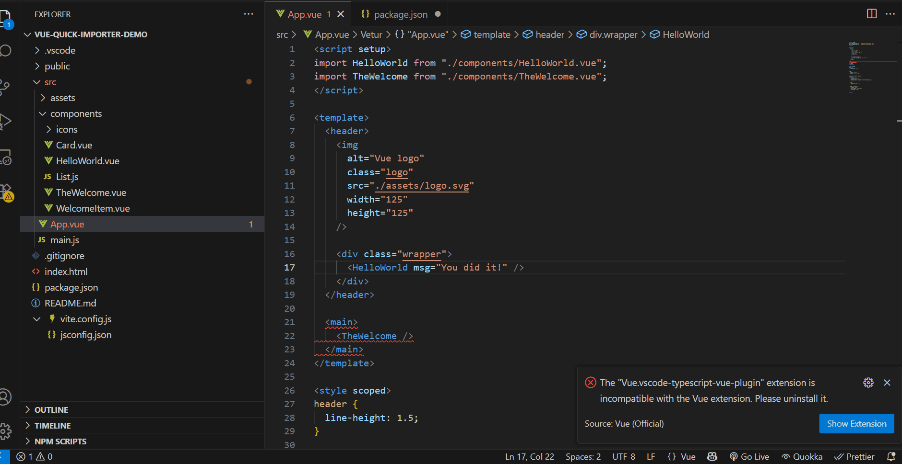

# 🧩 Vue Quick Import

<p align="center">
  
</p>

Right-click any Vue file to instantly import it into your active editor.  
Skip the typing and let the extension handle the import paths and component naming for you!

---


[](https://github.com/MenasriaMohamed/vue-smart-importer)

📦 [Install from VS Code Marketplace](https://marketplace.visualstudio.com/items?itemName=MenasriaMohamed.vue-quick-import)  
🔗 [View on GitHub](https://github.com/MenasriaMohamed/vue-smart-importer)

---

## 📚 Table of Contents

- [✨ Features](#-features)
- [🚀 How to Use](#-how-to-use)
- [📸 Demo](#-demo)
- [📝 Examples](#-examples)
- [🎯 Smart Features](#-smart-features)
- [📋 Requirements](#-requirements)
- [🛠️ Supported File Types](#️-supported-file-types)
- [🔧 Installation](#-installation)
- [⚙️ Configuration (Planned)](#️-configuration-planned)
- [🐞 Known Issues](#-known-issues)
- [🤝 Contributing](#-contributing)
- [⭐ Show Your Support](#-show-your-support)
- [📬 Contact](#-contact)
- [📄 License](#-license)

---

## ✨ Features

- ✅ **Right-click to import** — Simple context menu integration
- 🧠 **Smart path resolution** — Automatically calculates relative paths
- 🧱 **Component naming** — Converts filenames to proper PascalCase
- 🎯 **Intelligent insertion** — Adds imports in the right place
- 🔁 **Duplicate detection** — Prevents duplicate import statements
- 🔗 **Multi-format support** — Works with `.vue`, `.ts`, `.js`, `.tsx`, `.jsx`

---

## 🚀 How to Use

1. Open a Vue.js, JS, or TS file in your editor
2. Right-click any file in the Explorer panel
3. Select **"Import to Active File"**
4. ✅ Done! The import statement is added automatically

---

## 📸 Demo

<!-- > _(Replace this with your actual GIF or screenshot)_ -->

<p align="center">
  
</p>

---

## 📝 Examples

### 📦 Vue Component Import

```js
import UserCard from "./components/UserCard.vue";
```

### 📦 TypeScript/JavaScript Module Import

```ts
import dateUtils from "./utils/date-utils";
```

### 📦 Nested Path Resolution

```js
import Header from "../../components/layout/Header.vue";
```

---

## 🎯 Smart Features

### 🔠 Automatic Component Naming

| Filename           | Component Name |
| ------------------ | -------------- |
| `user-card.vue`    | `UserCard`     |
| `product_list.vue` | `ProductList`  |
| `nav-bar.vue`      | `NavBar`       |

### 📐 Path Intelligence

- Correct relative paths
- No extra file extensions
- Handles deep folders

### 📌 Import Positioning

- Inserts after existing imports
- Keeps order clean and organized

---

## 📋 Requirements

- **VS Code** `1.101.0` or higher
- Vue, JS, or TS-based project

---

## 🛠️ Supported File Types

| File Type | Supported | Import Style                     |
| --------- | --------- | -------------------------------- |
| `.vue`    | ✅        | `import Component from './path'` |
| `.ts`     | ✅        | `import module from './path'`    |
| `.js`     | ✅        | `import module from './path'`    |
| `.tsx`    | ✅        | `import module from './path'`    |
| `.jsx`    | ✅        | `import module from './path'`    |

---

## 🔧 Installation

### 📦 Via VS Code:

- Open VS Code
- Go to Extensions (`Ctrl+Shift+X`)
- Search **Vue Quick Import**
- Click **Install**

### 💻 Via Command Line:

```bash
code --install-extension vue-quick-import
```

---

## ⚙️ Configuration (Planned)

> Coming soon!  
> Future versions may support:

- Custom import formatting styles
- Ignored folders or file types
- Auto-import on file save or creation

---

## 🐞 Known Issues

- No support yet for `.scss`/`.css`/`.json` files
- Import order may not follow custom grouping

---

## 🤝 Contributing

Found a bug or have a feature idea?

- 🐛 [Submit an Issue](https://github.com/MenasriaMohamed/vue-smart-importer/issues)
- 📥 Fork the repo and make a pull request
- 💡 Request features through GitHub Issues

---

## ⭐ Show Your Support

If you find this extension helpful:

- 🌟 Star it on [GitHub](https://github.com/MenasriaMohamed/vue-smart-importer)
- 💬 Leave a review on the [Marketplace](https://marketplace.visualstudio.com/items?itemName=MenasriaMohamed.vue-quick-import)
- 📣 Share it with your Vue dev friends

---

## 📬 Contact

**Mohamed Menasria**  
📧 Email: *menasria1996mohamed@gmail.com*  
🌐 GitHub: [@MenasriaMohamed](https://github.com/MenasriaMohamed)

---

## 📄 License

Licensed under the [MIT License](LICENSE).

---

> Made with ❤️ for the Vue.js community
